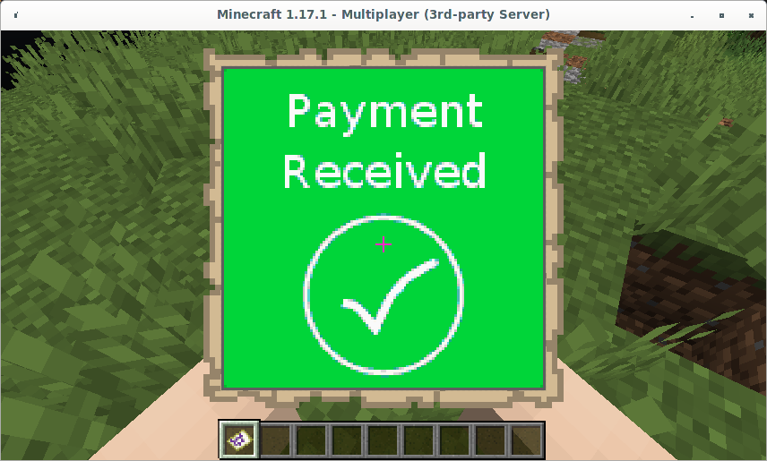

LnVault exposes 2 new commands lndeposit and lnwithdraw to deposit and withdraw funds via the Lightning Network.
<!--more-->  
LnVault currently only supports scanning Lightning invoices using a mobile wallet.

Recommended wallets are
- [Wallet of Satoshi](https://www.walletofsatoshi.com/) (Custodial)
- [Phoenix](https://phoenix.acinq.co/) (Non-Custodial)

# Deposit

The /lndeposit command is used to deposit via lightning. e.g.

 ```console
/lndeposit 1
```
Will initiate a deposit of 1 in game currency unit. (An exchange rate as configured by the server admin will be applied)

An lightning invoice will be placed in your hand. **One inventory slot must be free before making a deposit**


Scan this invoice using your mobile wallet. Check your wallet documentation for instructions on how to pay using a BOLT-11 QR-Code.


**Pay careful attention to the amount an exchange rate from in game to satoshis may have been applied**

Once the payment has sent the invoice will update to show the payment status.



Your lightning deposit is now available for spending in game. The deposited amount will now be visible in your in game balance. Check your economy plugin documenation for details on how to check your balance. For EssentialsX the /balance command can be used to check your balance.

 # Withdraw

The /lnwithdraw command is used to withdraw via lightning. e.g.

 ```console
/lnwithdraw 1
```
Will initiate a withdrawal of 1 in game currency unit. (An exchange rate as configured by the server admin will be applied)

A lightning invoice will be placed in your hand. **One inventory slot must be free before making a deposit**


Scan this invoice using your mobile wallet. Check your wallet documentation for instructions on how to withdraw using an LNURL-Withdraw QR-Code.


**Pay careful attention to the amount an exchange rate from in game to satoshis may have been applied**

Once the payment has sent the invoice will update to show the payment status.


Your lightning withdrawal is now available in your wallet and your in game balance has been reduced. Check your economy plugin documenation for details on how to check your balance. For EssentialsX the /balance command can be used to check your balance.