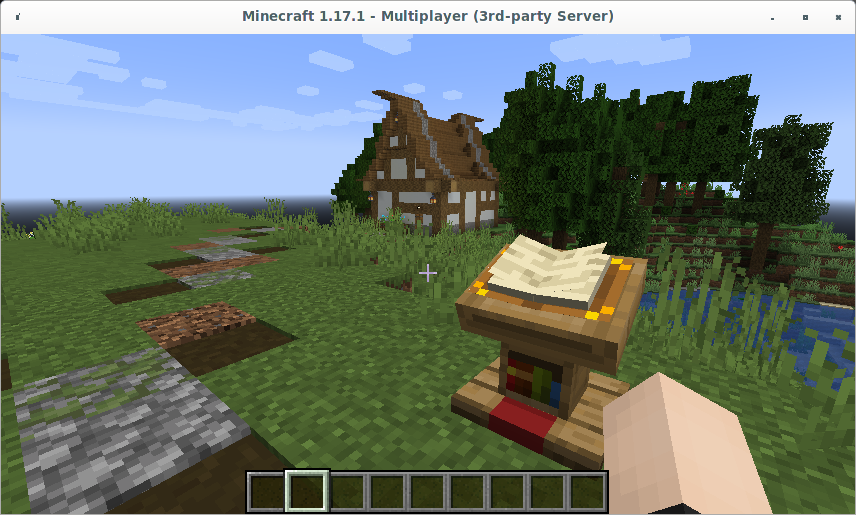
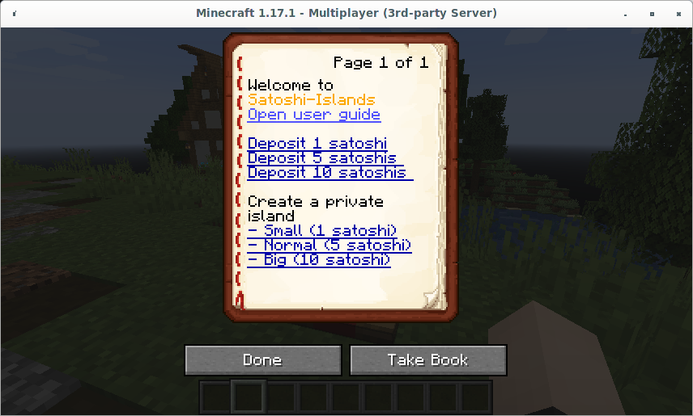
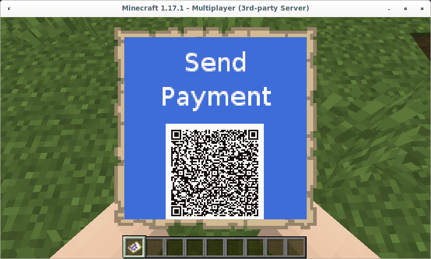
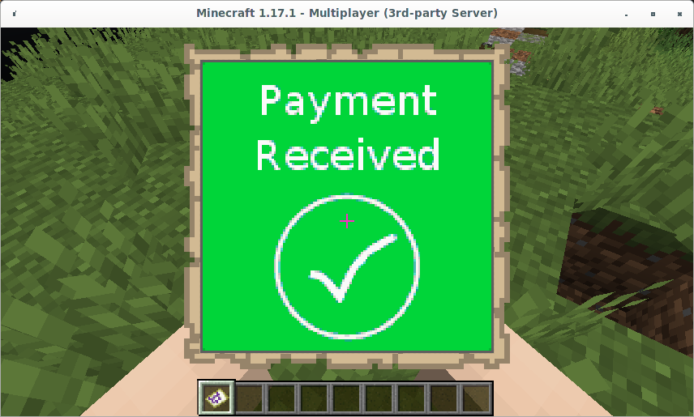
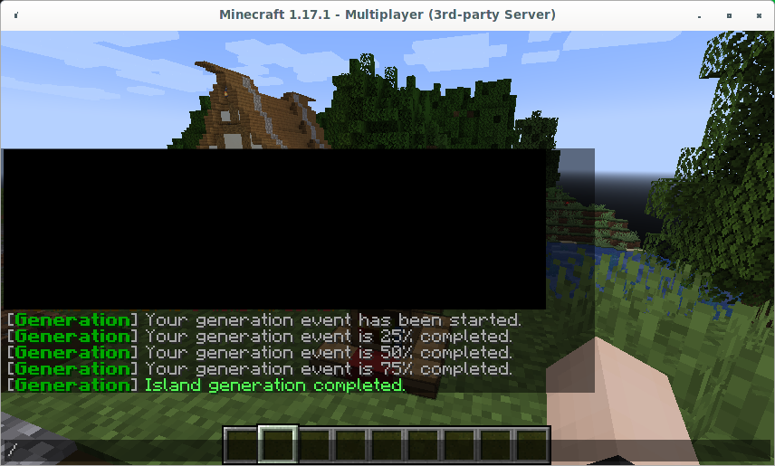

Welcome to Satoshi-Islands.
<!--more-->
## Pre-Requisites

Satoshi-Islands requires
- Minecraft Java Edition 1.17.1
- A Mobile Wallet that supports scanning BOLT11 QR Codes

## Quick Start

Join the server "satoshi-islands.net" you will be transported to the spawn island.



You can return here at any time by entering the command

```console
/visit spawn
```

Reading the book will provide clickable links that can be used to deposit funds and create your first island.



Open user guide will direct you to this website.

The deposit options will enable you to deposit Sats that can be used to create private islands. Islands created using the book will be made with a random biome. Check the full user guide for instructions on how to create an island with a specific biome.

**CAUTION: Deposited funds are considered a gift to the LnVault developers and CANNOT be withdrawn or refunded.**

For this quick start click on "Deposit 1 Satoshi" and scan the QR Code that is displayed in the invoice.



Once the payment is complete the invoce will update.



You can now return to the book and click "Small (1 Satoshi)" to create a private island.



Your island will generate in the background. Once completed you can teleport to your new island by entering the command

```console
/home
```

To acquire resources to build on your island simply jump off the side and you will be transported to the wilderness. Here you can mine for resources and return to your island with the "/home" command and don't forget to explore the spawn island.